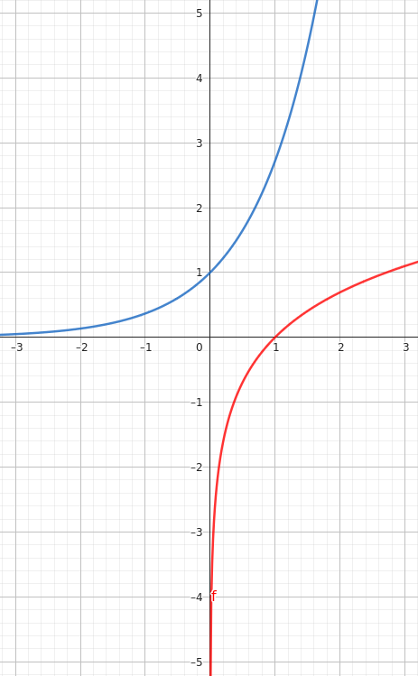

# Limites, sequências e séries
## Revisão limites
>**Obs**.: $a^b = e^{b \ln{a}}$
>Em particular: $\ln{e^x} = x, e^{\ln{x}} = x$

$$
\ln{r} \cdot +\infty = \{\begin{matrix}+ \infty & \text{, se } r>1  \\ - \infty & \text{, se } r<1\end{matrix}
$$

$$
\lim_{x\to\infty} r^x = \{\begin{matrix} e^{+\infty}=+\infty & \text{, se } r>1  \\ e^{-\infty}=0 & \text{, se } 0<r<1\end{matrix}
$$

>**Azul**: $f(x) = e^x$
>**Vermelho**: $f(x) = \ln{x}$
## Sequências numéricas
>**Ex**.: $1,2,3,4,5,...$
>$1,\frac{1}{2},\frac{1}{3},\frac{1}{4},\frac{1}{5},...$
>$1,-1,1,-1,1,-1,...$

Uma **sequência** ou **sucessão numérica** é uma função $f: A \rightarrow \mathbb{R}$, sendo um subconjunto de $\mathbb{N}$ da forma $\{n_0,n_0+1,n_0+2,...\}$, com $n_0 \in \mathbb{N}$.
>**Ex**.: $f(n)=\frac{1}{n}$, $n \geq 1$

É usual denotar $f(n)$ por $a_n,b_n,x_n, \text{etc.}$
Então, a sequência acima pode ser reescrita como $x_n=\frac{1}{n}$, $n \geq 1$, onde: $x_n=\frac{1}{n}$ é o **termo geral** da sequência $(x_n)$.
>**Notações**: $(a_n),(a_n)^{+\infty}_{n_0}, \{a_n\}, \{a_n\}^{+\infty}_{n_0}, (a_n)_{n \geq n_0}, \{a_n\}_{n \geq n_0}$

>**Ex**.:
>- Considere a sequência $(b_n)$ dada por $b_n=\frac{n+1}{n}$, $n \geq 1$
>	Então: $(b_n) = 2, \frac{3}{2}, \frac{4}{3}, \frac{5}{4}, ...$
>- $\{y_n\}$ dada por $y_n=(\frac{1}{2})^n$, $n \geq 1$
>	Então: $\{y_n\}=1,\frac{1}{2},\frac{1}{4},\frac{1}{8},...$
>- $x_n=\sqrt[n]{3}$, $n \geq 2$
>	Então: $\sqrt[2]{3}, \sqrt[3]{3}, \sqrt[4]{3}, \sqrt[5]{3},...$

>**Obs**.: $\{a_n = a_{n-1} + a_{n-2} \rightarrow$ Definição recursiva da seq. Fibonacci

>**Ex**.: $s_n=\sum_{k=1}^{n} \frac{1}{k}$, $n \geq 1$
>$s_1=\sum_{k=1}^{1} \frac{1}{1}=1$
>$s_1=\sum_{k=1}^{2} \frac{1}{2}=\frac{1}{2},...$

### Operações com sequências
- $(a_{n})\pm(b_{n})=(a_{n} \pm b_{n})$
- $k(a_{n})=(ka_{n})$
- $(a_{n})\cdot(b_{n})=(a_{n}\cdot b_{n})$
- $\frac{(a_{n})}{(b_{n})}=\left( \frac{a_{n}}{b_{n}} \right), \text{se } b_{n} \neq 0, \forall n$
>**Ex**.: $(a_{n})=\frac{1}{n};(b_{n})=\frac{n+1}{n}$
>$a_{n}+b_{n}=\frac{1}{n}+\frac{n+1}{n}=\frac{1+n+1}{n}=\frac{n+2}{n}$
>$(a_{n})+(b_{n})=(a_{n}+b_{n})$ dada pela fórmula acima
>$\to \left( \frac{1}{n} \right)+\frac{n+1}{n}=\frac{n+2}{n} \to 2\left( \frac{n+1}{n} \right)=\frac{2(n+1)}{n}$
>$\to \left( \frac{1}{n} \right) \cdot \left( \frac{n+1}{n} \right)=\left( \frac{n+1}{n²} \right)$
>$\to \frac{\left( \frac{1}{n} \right)}{\frac{n+1}{n}}=\left( \frac{\frac{1}{n}}{\frac{n+1}{n}} \right)=\frac{1}{n+1}$

### Limite de uma sequência
Dizemos que o limite da sequência $(x_{n})$ é um número real $L$ e escrevemos $\lim_{ n \to+\infty } x_{n}=L$, se $\forall \epsilon > 0$ existir $n_{0}$ tal que, $n>n_{0} \to |x_{n}-L| < \epsilon$
>**Ex**.: 
>a) $\lim_{ n \to +\infty }n^k=+\infty$
>
>b) $\lim_{ n \to +\infty }\sqrt[n]{ k }=1$
>
>c) $\lim_{ n \to +\infty }\sqrt[n]{ n }=1$
>d) $\lim_{ n \to +\infty }k^n=\begin{Bmatrix}+ \infty & \text{, se } r>1  \\  1 & \text{, se } r=1\\0 & \text{, se } -1<r<1 & \\ \nexists  & \text{, se } r<-1\end{Bmatrix}$
>
>e) $\lim_{ n \to +\infty }\log_{a}n=\begin{Bmatrix}+ \infty & \text{, se } a>1 \\ -\infty  & \text{, se } 0<a<1\end{Bmatrix}$
>
>f) $\nexists \lim_{ n \to +\infty }\sin n$
>$\nexists \lim_{ n \to +\infty }\cos n$
>$\nexists \lim_{ n \to +\infty }\tan n$, ... (para todas funções trigonométricas)
>
>g) $\lim_{ n \to +\infty }(3n²-5n+2)=\lim_{ n \to +\infty }n²\left( 3-\frac{5}{n} +\frac{2}{n²} \right)=+\infty \cdot  3=+\infty$
>
>h) $\lim_{ n \to +\infty } \frac{2n³-7n}{5n³+1}=\lim_{ n \to +\infty } \frac{n³\left( 2-\frac{7}{n} \right)}{n³\left( 5+\frac{1}{n} \right)}=\frac{2}{5}$
>
>i) $\lim_{ n \to +\infty } (\sqrt{ 3n²+1 }-1) = \lim_{ n \to +\infty } \left( \sqrt{ n²\left( 3+\frac{1}{n²} \right) }-n \right)$
>$\to \lim_{ n \to +\infty } \left( n\sqrt{ 3+\frac{1}{n²} }-n \right) = \lim_{ n \to +\infty } \left[ n\left( \sqrt{ 3+\frac{1}{n²} } -1\right) \right] = +\infty(\sqrt{ 3 }-1) = +\infty$
>j) $\lim_{ n \to +\infty } (\sqrt{ n²+2n-1 } -n) = \lim_{ n \to +\infty } \frac{(\sqrt{ n²+2n-1 }-n)(\sqrt{ n²+2n-1 }+n)}{\sqrt{ n²+2n-1 }+n}$
>$\to \lim_{ n \to +\infty } \frac{n²+2n-1-n²}{\sqrt{ n²+2n-1}+n} = \lim_{ n \to +\infty } \frac{n\left( 2-\frac{1}{n} \right)}{\sqrt{ n²(1+\frac{2}{n}-\frac{1}{n²}) }+n}$
>$\to \lim_{ n \to +\infty } \frac{n\left( 2-\frac{1}{n} \right)}{n\sqrt{ \left( 1+\frac{2}{n}-\frac{1}{n²} \right) }+n} = \lim_{ n \to +\infty } \frac{n+\left(  2-\frac{1}{n} \right)}{n\left( \sqrt{ 1+\frac{2}{n}-\frac{1}{n²} }+1 \right)}=\frac{2}{\sqrt{ 1 }+1}=\frac{2}{2}=1$

### Álgebra dos limites
$$
\lim_{ n \to +\infty }  a_{n} = L_{1}, \lim_{ n \to +\infty }  b_{n} = L_{2}, \text{sendo } (L_{1},L_{2}) \text{ reais ou } +\infty
$$
Então:
1. $\lim_{ n \to +\infty } (a_{n} \pm b_{n}) = L_{1}\pm L_{2}$
2. $\lim_{ n \to +\infty } (ka_{n}) = k\cdot L_{1}, k \text{ constante}$
3. $\lim_{ n \to +\infty } (a_{n} \cdot b_{n})=L_{1}\cdot L_{2}$
4. $\lim_{ n \to +\infty } \left( \frac{a_{n}}{b_{n}} \right) = \frac{L_{1}}{L_{2}}$
Desde que o respectivo lado direito não seja uma indeterminação.
>**Obs**.: As indeterminações são:

$$
\begin{matrix}
+\infty+(-\infty), &  -\infty+(+\infty) &  \\
+\infty-(+\infty), & -\infty-(-\infty) &  \\
0 \cdot \pm \infty, & \pm \infty\cdot 0 &  \\
\frac{0}{0}, & \frac{\pm \infty}{\pm \infty} &  \\
0⁰, & 1^{\pm \infty } &  \\
\end{matrix}
\pm \infty⁰
$$
Ou seja, **valem os seguintes resultados**:
1. $\lim_{ x \to +\infty } f(x) = L, (L \text{ real ou } \pm \infty)$ e se $a_{n} = f(n)$, então $\lim_{ n \to +\infty } a_{n} = L$
   **Ex**.: $\lim_{ n \to +\infty } \left( 1 + \frac{k}{n} \right)^n=e^{ k }, (k \in \mathbb{R})$
2. $\lim_{ n \to +\infty } a_{n}=0 \iff \lim_{ n \to +\infty } |a_{n}|=0$
   **Ex**.: $x_{n}=3\cdot(-1)^n, n \geq 1 \to (x_{n})=-3,3,-3,3,-3,3,\dots$
   $\nexists \lim_{ n \to +\infty } 3(-1)^n$
   Porém:
   $|x_{n}| = |3(-1)^n| = 3 \to (|x_{n}|) = 3,3,3,3,\dots$
   $\lim_{ n \to +\infty } |x_{n}| = 3$
3. **Teorema do confronto ou do sanduíche**: sejam $(a_{n}),(b_{n}) \text{ e } (c_{n})$ sequências tais que $a_{n} \leq c_{n} \leq b_{n}, \forall n\geq n_{0}$, então:
   $\lim_{ n \to +\infty } a_{n} = \lim_{ n \to +\infty } b_{n} = \lim_{ n \to +\infty } c_{n} = L$
   **Ex**.: $a_{n}=\frac{n!}{n^n},n \geq 1$ 
   $\frac{n!}{n^n}=\frac{n\cdot(n-1)\cdot(n-2)\dots 2 \cdot 1}{n\cdot n\cdot n\dots n\cdot n}=\frac{n}{n} \cdot \frac{n-1}{n} \cdot \frac{n-2}{n} \dots \frac{2}{n} \cdot \frac{1}{n}$
   $\to \frac{n-1}{n} \cdot \frac{n-2}{n} \dots \frac{2}{n} \cdot \frac{1}{n}$
   **Obs**.: $0 < a < 1 \text{ e } 0 < b < 1$
   $a < 1 \implies ab < 1 \cdot b \implies ab < b < 1$
   $= ab<1$
   Voltando:
   $\frac{n!}{n}=\frac{n-1}{n} \cdot \frac{n-2}{n} \dots \frac{2}{n} \cdot \frac{1}{n} \leq \frac{1}{n}$, pois cada parcela é menor que $1$
   $= 0 \leq \frac{n!}{n} \leq \frac{1}{n}$, mas $\lim_{ n \to +\infty } 0 = 0$ e $\lim_{ n \to +\infty } \frac{1}{n}=0$
   Ou seja:
   $\lim_{ n \to +\infty } \frac{n!}{n}=0$